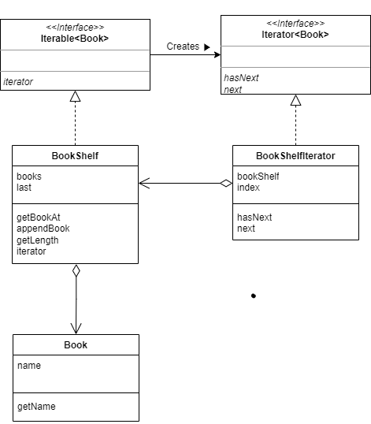

# Iterator 패턴
책 **JAVA 언어로 배우는 디자인 패턴 입문 3판** 을 읽고 정리한 내용입니다!

## Intro
Java 언어에서 배열의 모든 요소를 표시하려면 다음과 같이 for문을 사용합니다.
```java
int[] arr = {1, 2, 3, 4, 5};
for(int i=0; i<arr.length; i++>) {
    System.out.println(arr[i]);
}

// 결과
// 1
// 2
// 3
// 4
// 5
```

여기서 변수 i는 0부터 시작하여 하나씩 증가시키면, 현재 주목하는 요소는 '다음', '그 다음'으로 차례차례 진행됩니다. 배열의 길이-1 까지 i가 증가하기 때문에 위의 for 문에서는 모든 배열을 탐색하게 됩니다.
여기서 i의 역할을 추상화하여 일반화한 것을 디자인 패턴에서는 **Iterator 패턴**이라고 합니다.

Iterator 패턴은 무언가 많이 모여 있을 때 이를 **순서대로 가리키며 전체를 검색하고 처리를 반복하는 것**입니다.


## 예제 코드 클래스 다이어그램


위 클래스들의 코드는 github를 참고해주세요 !


## Iterator 패턴을 사용하는 이유
배열이면 for문으로 빙글빙글 돌리면 되는데 왜 집합체 외부에 Iterator같은 것을 만들어서 번거롭게 구현할까요?

가장 큰 이유는 Iterator를 사용하여 **구현과 분리** 하여 반복할 수 있기 때문입니다.
```java
while(iteraor.hasNext) {
    Book book = iteraor.next();
    System.out.println(book.getName());
}
```

이 코드에서는 BookShelf 구현에 사용된 메소드는 호출되지 않습니다.  
위의 반복문에서는  **BookShelf 구현에 의존하지 않는다**는 뜻

만약에 BookShelf를 구현한 사람이 배열 대신에 ArrayList를 사용하는것으로 변경하여도, BookShelf가 iterator 메소드를 가지고 있고 올바른 `Iteraor<Book>`을 반환하기만 한다면 위의 while 루프는 변경하지 않아도 동작하게 됩니다.


## 관련 패턴
- Visitor 패턴
- Composite 패턴
- Factory Method 패턴

## 연습문제
예제 프로그램의 BookShelf 클래스에서는 처음 지정한 책장 크기를 넘어서 책을 넣을 수 있습니다. 무리하게 넣으려고 하면, `java.lang.ArrayIndexOutOfBoundsException` 예외가 발생하게 됩니다. 그러므로 `java.util.ArrayList`를 사용하여 책장 크기를 넘어도 책을 추가할 수 있게 만들어보세요.


