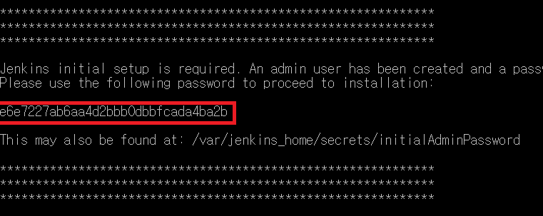

# 도커로 젠킨스 설치, 설정 가이드

[https://hub.docker.com/r/jenkins/jenkins](https://hub.docker.com/r/jenkins/jenkins)

도커허브 사이트에서 Jenkins 검색 → 사용하고자 하는 JDK 버전의 태그가 달린 docker pull 명령어를 입력한다.

나같은 경우 자바 11버전이기에 태그가 latest-jdk11인 이미지를 다운로드 받았다.

```java
docker pull jenkins/jenkins:latest-jdk11
```

젠킨스 도커 공식 사이트 : [https://github.com/jenkinsci/docker](https://github.com/jenkinsci/docker)

위 링크에서 docker run 명령어 몇가지 예시를 살펴볼 수 있다. 나는 백그라운드에서도 실행을 유지하기 위하여 `**-d**` 옵션을 붙이고, `**—name`** 옵션으로 컨테이너의 이름을 jenkins-server로 주어서 실행시켰다

```java
docker run -p 8080:8080 -p 50000:50000 --restart=on-failure -d --name jenkins-server jenkins/jenkins:latest-jdk11
```

위에서 뒤의 태그가 없이 `**run`** 명령어로 실행하게 된다면 latest의 이미지를 찾기에, 오류가 발생할 수 있으므로 태그를 꼭 확인하도록 하자. 

컨테이너가 가동되었다면, 브라우저를 열고 `**[localhost:8080](http://localhost:8080)`**  에 들어가보면 젠킨스 대시보드에 접근할 수 있는 화면이 나온다. 여기서 키를 입력해주어야 하는 칸이 나오는데, 다음의 명령어로 해당 키값을 확인할 수 있다.

```java
docker logs jenkins-server

```



위 빨간색 네모칸의 키값을 어딘가에 잘 복사해서 저장한 뒤, 


[localhost:8080](http://localhost:8080) 에 접속하였을 때 위의 Input 칸에 넣어주면 된다.


이제 계정생성을 한 뒤,


<br>


별 설정 없이 위 버튼들을 누르면!


젠킨스 대시보드에 성공적으로 접속할 수 있게된다.

만약 docker stop 명령어로 젠킨스 서버를 중지했다가 다시 접속할 경우, 위에서 설정한 계정 ID와 비밀번호로 다시 로그인하여 대시보드에 접속할 수 있다!