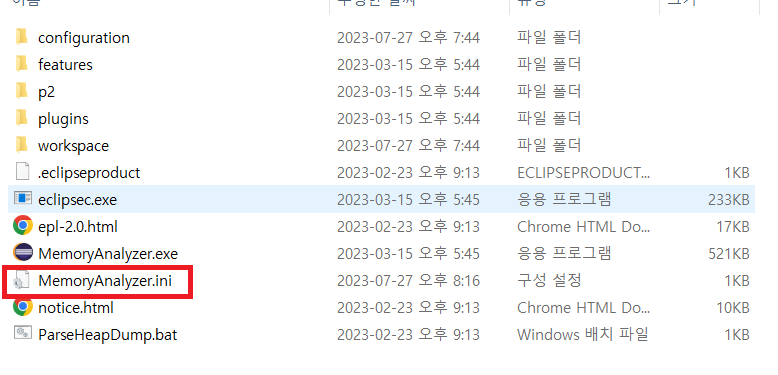
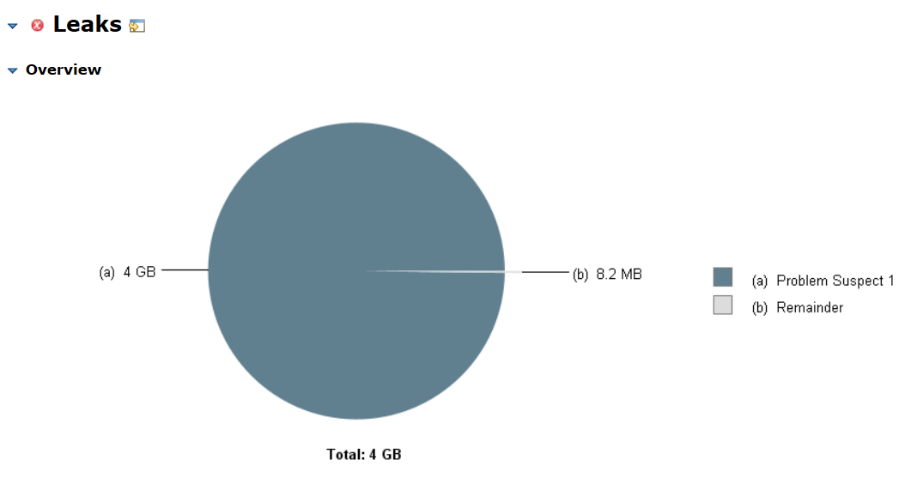
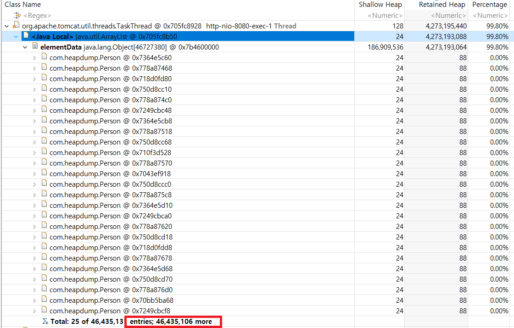

# Heap Dump분석을 해보자!

## Intro
Spring으로 개발한 웹 애플리케이션을 운영하다 보면, 
위에서 언급한 메모리 누수도 발생할 수 있지만 많은 트래픽이 몰리거나 
구현 상의 버그로 인해 Heap의 사용량이 순간적으로 크게 증가할 수 있습니다. 
이 경우 GC가 과도하게 일어나면서 애플리케이션의 성능을 저해할 수 있고, 
심한 경우에는 OOM(Out Of Memory) 에러가 발생하여 애플리케이션이 다운될 수 있습니다.
해당 에러가 발생하면 코드 상으로 어떠한 객체가 원인인지 찾아내기 상당히 어렵기 때문에 
OOM이 발생한 시점 혹은 그 근방에 시점에 대해 Heap Dump를 분석해야 합니다.

## OutOfMemoryError API 호출
먼저 OOM을 내기 위한 Api를 하나 간단하게 만들어보겠습니다. 

```java
@Data
@Builder
public class Person {
    private String name;
    private int weight;
    private int height;
}
```

```java
@Slf4j
@RestController
@RequestMapping("/api")
public class OutOfMemoryErrorController {

    @GetMapping("/outOfMemory")
    public int register() {
        List<Person> people = new ArrayList<>();

        // 1억개의 객체가 생성되어 힙 메모리에 올라갈 것이다.
        for(int i=0; i<100000000; i++) {
            Person person = Person.builder()
                    .name("Hyun Woo Choi"+i)
                    .weight(i%120)
                    .height(i%120)
                    .build();

            people.add(person);
        }

        log.info("Person count={}", people.size());
        return people.size();
    }
}
```

1억개의 Person 객체를 for문으로 List에 담아 size를 return하는 api를 만들었습니다.
정말로 OOM이 발생하는지 확인해보기 위하여 서버를 시작한 뒤, 브라우저를 켜서 `/api/outOfMemory`에 GET 요청을 해줍니다.  

  

<br>


예상대로 OOM이 발생한 걸 확인할 수 있습니다.

## OOM 발생시 Heap Dump 자동생성시키기
원인을 분석해보고자 OutofMemoryError가 발생하였을 때 Heap Dump를 떠서 분석을 해봐야하는데요,  
어플리케이션을 중지시킨 뒤에 IntelliJ에서 VM옵션을 다음과 같이 `-XX:+HeapDumpOnOutOfMemoryError` 라는 옵션을 추가하여 다시 실행해줍니다.


위 옵션은 OutOfMemoryError가 발생하면 자동으로 Heap Dump를 생성해줍니다.

위 옵션으로 어플리케이션을 실행하여 다시 브라우저를 열고 `/api/outOfMemory`에 요청을 보내면..  


이렇게 OutOfMemoryError가 발생하였을 때 자동으로 힙 덤프를 떠서 어플리케이션 폴더에 5.8기가정도 크기의 `java_pid8656.hprof` 파일을 만들어줍니다!

이제 이 `java_pid8656.hprof` 파일을 힙 덤프 분석 툴을 이용하여 열어야 하는데요 가장 많이 사용하는것이 Eclipse Memory Analyzer(MAT) 라고 합니다.

https://eclipse.dev/mat/downloads.php  

위 링크에서 운영체제에 맞는 Stand-Alone(독립형) 버전을 다운받고 압축을 풀어줍니다.  

이제 분석을 시작하면되지만 주의할 점이 MAT 툴이 할당할 수 있는 메모리의 크기가 분석하려는 Heap Dump 크기보다 커야 합니다.

그래서 한가지 설정을 해주어야하는데요,


빨간색으로 표시되어있는 `MemoryAnalyzer.ini` 파일을 열고 아래의 옵션을 추가합니다.

```
-vmargs
-Xmx15G
-XX:-UseGCOverheadLimit
```
저는 Xmx크기를 15G로 했지만 다르게 하실 분들은 다르게 하셔도 상관없습니다. (HeapDump의 크기보다 크면 됩니다.)  
이제 `MemoryAnalyzer.ini` 위의 보라돌이 `MemoryAnalyzer.exe` 를 실행한 후,


빨간색으로 표시된 Open a Heap Dump 버튼으로 만들어둔 `java_pid8656.hprof`를 열면...


아주 극단적으로 힙영역을 가득 채우고있는 Problem Suspect 1 이라는 녀석을 확인할 수 있게 됩니다..


무려 99.80%이나 차지하고 있는 이녀석의 정체를 확인하기 위하여 하단의 `Dominator Tree`를 클릭해줍니다.


이렇게 우리는 Person 객체가 4천6백만개나 생성되어 OOM을 일으킨 것을 추측이 아닌 객관적인 자료를 통하여 눈으로 확인할 수 있게 되었습니다!


## VM 옵션 없이 Heap Dump 생성하기
위에선 OOM이 발생하였을 때 자동으로 Heap Dump를 생성하도록 하였는데요, 미리미리 대비하기 위하여 아래의 명령어를 통해 수동으로 Heap Dump를 생성할 수 있습니다.

### 현재 JVM에서 실행되고 있는 프로세스의 PID 목록 출력
```agsl
jps
```

### Heap Dump 명령어(둘중 택1)
```agsl
jmap -dump:format=b,file={파일이름}.hprof {PID}
jcmd {PID} GC.heap_dump {파일이름}.hprof
```

jps 명령어로 JVM에서 실행되고 있는 애플리케이션의 PID 목록 확인 뒤, jmap 또는 jcmd 명령어를 실행하면 수동으로 HeapDump를 할 수 있게됩니다. 이후엔 MAT로 분석하면 되겠죠?

## 요약
1. 코드레벨에서 해결하려고 해본다.
2. 문제점이 발견되지 않는다면 Heap 모니터링을 해본다.
3. 의심이간다면 Heap Dump를 분석해본다.
4. 범인을 색출하여 해결방안을 모색한다.

## Reference
[Heap 모니터링 & Heap Dump 분석하기](https://steady-coding.tistory.com/591)

[가비지 컬렉터의 원리? 과연 그것만 물은 걸까요?](https://www.youtube.com/watch?v=v1gb397uFC4&list=PLXvgR_grOs1DEoZFABFCjo7dsXt1BhVih&index=11)

[우아한 형제들 기술블로그 - 도움이 될수도 있는 JVM memory leak 이야기](https://techblog.woowahan.com/2628/)


